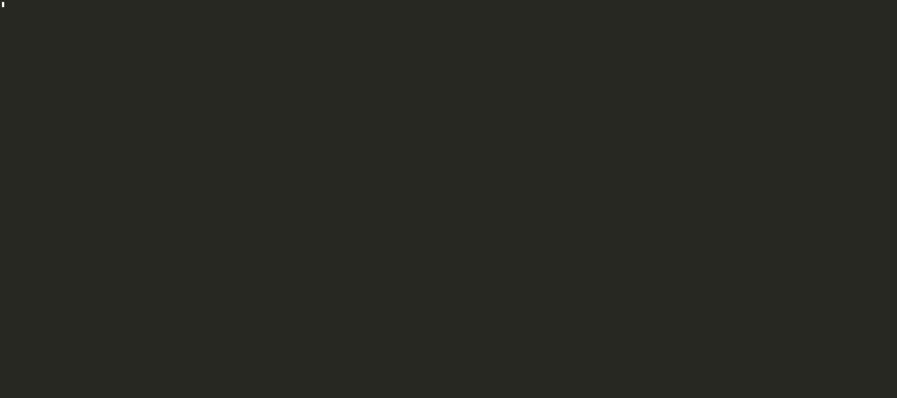

# AsciiArtify — Concept локального Kubernetes середовища для PoC

## 1. Вступ

Команда **AsciiArtify** планує створити сервіс, який перетворює зображення на ASCII-art за допомогою ML. Для подальшого продакшн-розгортання стартап орієнтується на Kubernetes, тому навіть локальне середовище розробки має бути максимально схожим на реальне.

Розглядаються три інструменти для локального Kubernetes:

- **minikube** — “класичний” локальний Kubernetes у вигляді одного вузла (можна робити multi-node), орієнтований саме на девелоперів.
- **kind (Kubernetes in Docker)** — кластер Kubernetes усередині Docker-контейнерів. Дуже швидкий для CI.
- **k3d** — обгортка над k3s (легковаговий Kubernetes від Rancher), що запускає кластер у Docker. Часто використовується для PoC і швидких середовищ.

Також треба врахувати ризики з ліцензуванням **Docker Desktop** (для macOS/Windows у компаніях) і мати опцію запуску на **Podman**.

---

## 2. Характеристики

### 2.1 Загальна таблиця порівняння

| Критерій                              | minikube                                                                 | kind (Kubernetes in Docker)                                             | k3d (k3s in Docker)                                                     |
|---------------------------------------|--------------------------------------------------------------------------|-------------------------------------------------------------------------|-------------------------------------------------------------------------|
| Тип інструмента                       | Локальний Kubernetes, фокус на девелоперів                              | Kubernetes-кластер всередині Docker-контейнерів                        | Легкий Kubernetes (k3s) у Docker                                        |
| Підтримувані ОС                       | Linux, macOS, Windows                                                   | Linux, macOS, Windows                                                   | Linux, macOS, Windows                                                   |
| Архітектури                           | amd64, arm64 (на Mac M1/M2 через драйвери)                               | amd64, arm64                                                            | amd64, arm64 (k3s добре почувається на arm)                             |
| Залежність від Docker                 | Може працювати з Docker, Podman, containerd, CRI-O                       | Потребує Docker (Podman - KIND_EXPERIMENTAL_PROVIDER).                  | k3d використовує Docker API та сумісний з Podman v4 та вище             |
| Автоматизація (CI)                    | Можна, але повільніше                                                    | Дуже популярний у CI, швидкий старт                                    | Теж можна автоматизувати, хороша швидкість                              |
| Multi-node                            | Так                                                                      | Так (описом кластера YAML)                                             | Так (параметри CLI)                                                     |
| Додаткові addons                      | Є `minikube addons` (ingress, dashboard, registry)                       | Немає вбудованих addons, ставимо manifest’ами                          | Немає addons, але k3s уже спрощений                                  |
| Робота з ingress                      | Дуже проста: `minikube addons enable ingress`                            | Ставимо nginx/traefik вручну                                            | Зазвичай ставимо ingress вручну                                         |
| Швидкість підняття                    | Середня                                                                  | Висока                                                                  | Висока                                                                  |
| Схожість на “повний” Kubernetes       | Висока (хоч і single-node за замовчуванням)                              | Висока, але все в контейнерах Docker                                   | Дещо відрізняється (k3s — спрощений)                                   |
| Документація / ком’юніті              | Дуже велика                                                              | Дуже велика                                                             | Велика, але менша ніж у minikube/kind                                   |
| Крива входу для junior                 | Найбільш дружній                                                         | Потрібно розуміти Docker в Docker                                      | Досить дружній, CLI простий                                             |

---

### 2.2 Примітки щодо Docker / Podman

- **Docker Desktop** для комерційного використання може вимагати ліцензію. Для стартапу це додаткові витрати.
- **minikube** — найгнучкіший у плані драйверів: можна запускати на Linux із systemd + Podman (`minikube start --driver=podman`).
- **kind/** усе ще офіційно орієнтований на Docker. Підтримка Podman в експериментальному режимі.
- **k3d** (v5.8.3+)** тепер **офіційно підтримує Podman**. Це значне оновлення.  
  - Підтримується як rootful, так і rootless режими.  
  - Потрібен Podman v4+ з увімкненим REST API socket.  
  - K3d використовує змінну середовища `K3D_RUNTIME=podman` або `--runtime podman`.  
  - Необхідно створити мережу вручну (`podman network create k3d`) перед запуском кластера.  
  - Повна інструкція: [k3d.io/v5.8.3/usage/advanced/podman](https://k3d.io/v5.8.3/usage/advanced/podman/)

> 🔹 **Висновок щодо Podman:** k3d тепер — найкращий варіант серед lightweight Kubernetes для середовищ без Docker Desktop.  

---

## 3. Переваги та недоліки

### 3.1 minikube

**Переваги:**
- Добре задокументований, багато прикладів.
- Має вбудовані addons (dashboard, ingress, registry) — швидко розгортається демо-стенд.
- Гнучкий щодо драйверів: Docker, Podman, KVM, VirtualBox, Hyper-V.
- Ближчий до “звичайного” Kubernetes за відчуттями.
- Простий для демонстрацій.

**Недоліки:**
- Трохи повільніший старт порівняно з kind/k3d.
- Для CI не завжди зручно.
- Multi-node є, але налаштовується не так елегантно, як у kind.

**Коли використовувати:** коли потрібно “просто працює” на лептопах розробників і є ризики з Docker Desktop → беремо minikube + Podman.

---

### 3.2 kind

**Переваги:**
- Швидко розгортається — усе в Docker.
- Ідеально підходить для CI (GitHub Actions, GitLab CI).
- Кластери описуються YAML’ом → легко відтворювати.
- Підходить для тестування маніфестів, Helm-чартів, admission-логіки.

**Недоліки:**
- Залежність від Docker (Podman в експерементальному режимі).
- Немає вбудованих addons — усе ставимо вручну.
- Менш дружній для тих, хто “тільки починає” з Kubernetes.

**Коли використовувати:** коли треба часто створювати/видаляти кластери під тести або в CI.

---

### 3.3 k3d

**Переваги:**
- Базується на k3s — він легкий, невибагливий за ресурсами.
- Швидкий старт, як у kind.
- Дуже зручне CLI: можна створити кластер і одразу опублікувати порт.
- Добре підходить для PoC і edge-сценаріїв.

**Недоліки:**
- Це не “ванільний” Kubernetes, а k3s (хоч він сумісний з більшістю речей).
- Також орієнтований на Docker як backend.
- Документація велика, але спільнота трохи менша, ніж у minikube/kind.

**Коли використовувати:** коли треба легкий кластер для PoC/демо, або якщо сервіс буде потім мігрувати на k3s.

---

## 4. Демонстрація (рекомендований інструмент)

**Рекомендація для PoC AsciiArtify:** взяти **k3d**. Причини:
1. дуже швидко стартує → зручно для частих демонстрацій;
2. легший за “повний” Kubernetes → підходить для лептопів, віртуальних середовищ (наприклад github codespace);
3. простий CLI → розробники без навичок DevOps зможуть використати.

Нижче — коротке демо “Hello World” (deployment + service) для k3d.

### 4.1 Створення кластера k3d  та namespace 'demo'

```bash
# встановити k3d: https://k3d.io/#installation
curl -s https://raw.githubusercontent.com/k3d-io/k3d/main/install.sh | bash
k3d cluster create k3d-demo --agents 3 --servers 1
# перевірити
kubectl get nodes
kubectl create namespace demo
```
### 4.2 Створюємо yaml файля для deployment та service
deployment.yml
```yaml
    apiVersion: apps/v1
    kind: Deployment
    metadata:
      name: hello-world-deployment
      namespace: demo
    spec:
      replicas: 1
      selector:
        matchLabels:
          app: hello-world
      template:
        metadata:
          labels:
            app: hello-world
        spec:
          containers:
          - name: hello-world-container
            image: paulbouwer/hello-kubernetes:1.10 # Example image
            ports:
            - containerPort: 8080
```
service.yml
```yaml
    apiVersion: v1
    kind: Service
    metadata:
      name: hello-world-service
      namespace: demo
    spec:
      selector:
        app: hello-world
      ports:
        - protocol: TCP
          port: 80
          targetPort: 8080
      type: NodePort # Or LoadBalancer for cloud
```
### 4.3 Додаємо deployment та service до кластера, перевіряємо, робимо forward порта
```bash
kubectl apply -f deployment.yml
kubectl apply -f service.yml
kubectl -n demo get pods
kubectl -n demo get svc
kubectl -n demo port-forward svc/hello-world-service  8080:80
```
### 4.4 В сусідньому терміналі перевіряємо доступність сервісу
```bash
curl http://localhost:8080
<!DOCTYPE html>
<html>
<head>
    <title>Hello Kubernetes!</title>
    <link rel="stylesheet" type="text/css" href="/css/main.css">
    <link rel="stylesheet" href="https://fonts.googleapis.com/css?family=Ubuntu:300" >
</head>
<body>

  <div class="main">
    
    <div class="content">
      <div id="message">
  Hello world!
</div>
<div id="info">
  <table>
    <tr>
      <th>namespace:</th>
      <td>-</td>
    </tr>
    <tr>
      <th>pod:</th>
      <td>hello-world-deployment-89d454f76-sxrl7</td>
    </tr>
    <tr>
      <th>node:</th>
      <td>- (Linux 6.8.0-1030-azure)</td>
    </tr>
  </table>
</div>
<div id="footer">
  paulbouwer/hello-kubernetes:1.10.1 (linux/amd64)
</div>
    </div>
  </div>

</body>
```
### 4.5 Демо: Hello World для k3d

Нижче показано коротке демо розгортання `Deployment` + `Service` у кластері k3d, а також перевірки доступності сервісу через `kubectl port-forward` та `curl`:


