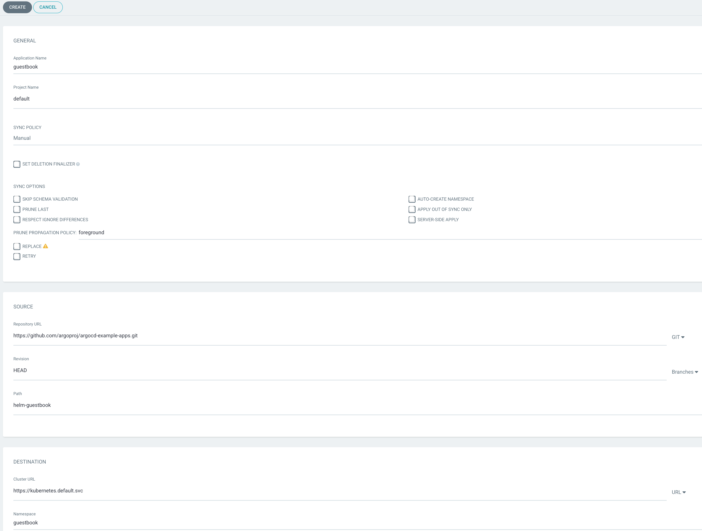
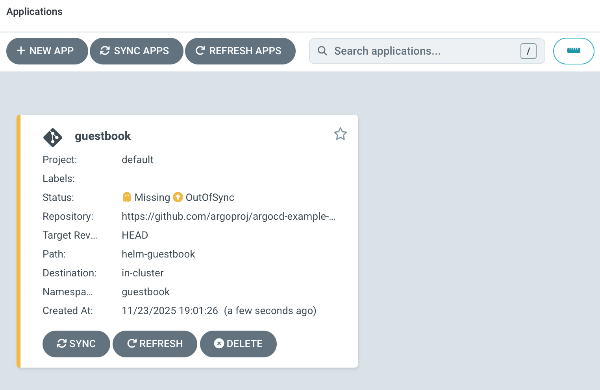
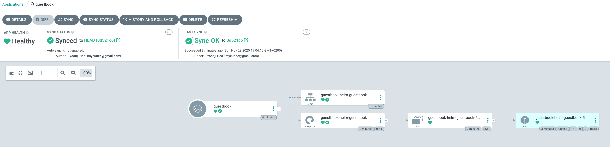
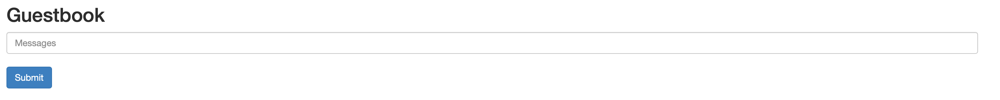
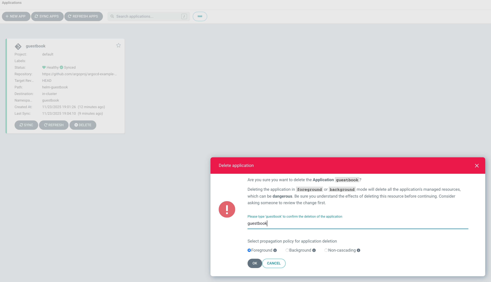

# PoC: GitOps-розгортання AsciiArtify з Argo CD на k3d

Цей документ описує Proof of Concept (PoC) розгортання GitOps-системи для **AsciiArtify** на Kubernetes-кластері, створеному за допомогою **k3d**, з використанням **Argo CD**.

Мета PoC:

- Використати Kubernetes-кластер, визначений у [`doc/Concept.md`](./Concept.md)
- Створити кластер за допомогою `k3d`
- Встановити Argo CD у кластер
- Налаштувати доступ команди до веб-інтерфейсу Argo CD
- Продемонструвати деплой демо-додатку через GitOps

---

## 0. Передумови

Потрібно:

- Встановлений **Docker**
- Встановлений **k3d**
- Встановлений **kubectl**
- Клонований репозиторій AsciiArtify:

    git clone https://github.com/gray380/AsciiArtify.git
    cd AsciiArtify

Перевірка:

    docker version
    k3d version
    kubectl version --client

---

## 1. Створення Kubernetes-кластера за допомогою k3d

### 1.1. Створити кластер

Створюємо мінімальний кластер для PoC:

    k3d cluster create asciiartify \
      --servers 1 \
      --agents 1 \
      --api-port 6445 \
      --wait

Пояснення:

- `asciiartify` — назва кластера
- `--api-port 6445` — проброс Kubernetes API на хост
- `--servers 1`, `--agents 1` — мінімальна PoC-конфігурація

### 1.2. Налаштувати kubectl на k3d-кластер

    kubectl config use-context k3d-asciiartify
    kubectl get nodes

Очікуваний результат: 1–2 ноди у статусі `Ready`.

---

## 2. Встановлення Argo CD у кластер

### 2.1. Створити namespace

    kubectl create namespace argocd

(Якщо namespace вже існує — попередження можна ігнорувати.)

### 2.2. Застосувати офіційний маніфест Argo CD

    kubectl apply -n argocd -f https://raw.githubusercontent.com/argoproj/argo-cd/stable/manifests/install.yaml

Перевірити, що всі pod-и стартували:

    kubectl get pods -n argocd

Очікувані поди в стані `Running` / `Completed`, зокрема:

- `argocd-server`
- `argocd-repo-server`
- `argocd-application-controller`
- `argocd-redis`

---

## 3. Доступ до веб-інтерфейсу Argo CD

### Варіант A (рекомендовано для PoC): Port-forward

    kubectl port-forward svc/argocd-server -n argocd 8080:443

- Команда блокує поточний термінал — залиште її запущеною.
- UI Argo CD буде доступний за адресою: **https://localhost:8080**

У браузері, скоріш за все, потрібно підтвердити виключення для self-signed сертифіката.

### (Опційно) Варіант B: NodePort + проброс порта k3d

Якщо потрібен статичний доступ без `kubectl port-forward`, кластер можна створити так:

    k3d cluster create asciiartify \
      --servers 1 \
      --agents 1 \
      --api-port 6445 \
      --port "8080:30080@server:0" \
      --wait

Після встановлення Argo CD змінити сервіс:

    kubectl patch svc argocd-server -n argocd -p '{
      "spec": {
        "type": "NodePort",
        "ports": [
          {
            "name": "https",
            "port": 443,
            "targetPort": 8080,
            "nodePort": 30080
          }
        ]
      }
    }'

Тоді UI Argo CD буде доступний за адресою: **https://localhost:8080**

---

## 4. Доступ адміністратора до Argo CD

### 4.1. Облікові дані адміністратора

За замовчуванням:

- **Логін:** `admin`
- **Пароль:** збережений у Secret `argocd-initial-admin-secret` у namespace `argocd`

Отримати пароль:

    kubectl -n argocd get secret argocd-initial-admin-secret \
      -o jsonpath="{.data.password}" | base64 -d; echo

Рекомендовано після зміни пароля видалити початковий секрет:

    kubectl delete secret argocd-initial-admin-secret -n argocd

### 4.2. Логін у веб-інтерфейс

1. Запустити port-forward (якщо використовується варіант A):

       kubectl port-forward svc/argocd-server -n argocd 8080:443

2. Відкрити у браузері: **https://localhost:8080**
3. У формі логіну ввести:
   - Username: `admin`
   - Password: `<пароль з попереднього кроку>`
4. Після входу змінити пароль:
   - Меню користувача (праворуч угорі) → **Change password**

---

## 5. Демо: деплой тестового застосунку через Argo CD

Для демонстрації GitOps використаємо офіційний демо-репозиторій:

- Репозиторій: `https://github.com/argoproj/argocd-example-apps.git`
- Додаток: `guestbook`

### 5.1. Створення Application через UI Argo CD

1. Зайти в UI Argo CD як `admin`.
2. Натиснути **+ NEW APP** (або **CREATE APPLICATION**).
3. Заповнити форму:

   **GENERAL**

   - Application Name: `guestbook`
   - Project: `default`
   - Sync Policy: `Manual`

   **SOURCE**

   - Repository URL: `https://github.com/argoproj/argocd-example-apps.git`
   - Revision: `HEAD` (або `main`)
   - Path: `helm-guestbook`

   **DESTINATION**

   - Cluster: `https://kubernetes.default.svc`
   - Namespace: `guestbook`

   **SYNC OPTIONS**
   - check `Auto-Create Namespace`

4. Натиснути **Create**. 

5. Відкрити створений Application → натиснути **SYNC** → **SYNCHRONIZE**.



### 5.2. Перевірка деплою guestbook

    kubectl get pods -n guestbook
    kubectl get svc -n guestbook

Очікуємо поди `guestbook-helm-guestbook` у стані `Running` та сервіс для доступу до застосунку.
```bash
kubectl get pods -n guestbook
NAME                                        READY   STATUS    RESTARTS   AGE
guestbook-helm-guestbook-5b66c4c879-9qt8x   1/1     Running   0          3m38s
```
```bash
kubectl get svc -n guestbook
NAME                       TYPE        CLUSTER-IP      EXTERNAL-IP   PORT(S)   AGE
guestbook-helm-guestbook   ClusterIP   10.96.121.218   <none>        80/TCP    4m25s
```
Швидкий доступ до guestbook через port-forward:

    kubectl port-forward svc/guestbook-helm-guestbook -n guestbook 8081:80

Після цього застосунок буде доступний за адресою: **http://localhost:8081**

---

## 6. Очищення середовища PoC (за потреби)

### 6.1. Видалити демо-застосунок

1. Видалити Application `guestbook` в UI Argo CD.

2. Видалити namespace:

       kubectl delete namespace guestbook

### 6.2. Видалити Argo CD

    kubectl delete namespace argocd

### 6.3. Видалити k3d-кластер

    k3d cluster delete asciiartify

---

## 7. Резюме PoC

У результаті цього PoC:

- Створено Kubernetes-кластер `asciiartify` за допомогою **k3d**
- Встановлено **Argo CD** у namespace `argocd`
- Налаштовано доступ до UI Argo CD (через `kubectl port-forward` або NodePort + `k3d --port`)
- Продемонстровано GitOps-деплой демо-застосунку `guestbook`

Система готова до подальшої реалізації MVP AsciiArtify з використанням GitOps-підходу.
